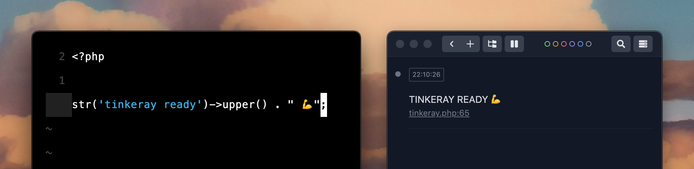

# Tinkeray

Heavily inspired by the absolutely awesome [Tinkerwell](https://tinkerwell.app/), run Laravel `artisan tinker` from a Vim buffer with output in [Ray](https://spatie.be/products/ray) 🖤



- [Installation](#installation)
- [Usage](#usage)
- [Laravel Sail](#laravel-sail)
- [Todo](#todo)
- [Thank You](#thank-you)

## Installation

1. Install using [vim-plug](https://github.com/junegunn/vim-plug) or similar:

    ```vim
    Plug 'jesseleite/vim-tinkeray'
    ```

2. Add `tinkeray.php` to your [global git excludes](https://gist.github.com/subfuzion/db7f57fff2fb6998a16c) file.

3. Add Tinkeray's mapping to stub and/or open a blank `tinkeray.php` in your project when you want to tinker:

    ```vim
    nmap <Leader>t <Plug>TinkerayOpen
    ```

## Usage

1. Install Ray into your project:

    ```bash
    composer require spatie/laravel-ray
    ```

2. Run `:TinkerayOpen` (or activate the above mentioned mapping) to stub out and/or open a blank `tinkeray.php` file in your project when you want to tinker.

3. Open the [Ray](https://spatie.be/products/ray) desktop app.

4. When you save `tinkeray.php`, you should see your returned output in Ray.

5. Order pizza! 🍕 🤘 😎

## Laravel Sail

If you are using Laravel Sail, you will also need to add the following to your vim config:

```vim
call tinkeray#set_sail()
```

By default, this will configure Tinkeray to use the default `laravel.test` Docker service setup by Sail. If you have customized this in your docker file, you may pass your service name into the above `set_sail('my-service.test')` function.

## Thank You!

- [Spatie](https://spatie.be/) and [BeyondCode](https://beyondco.de/) for rad tooling!
- [Jose Soto](https://twitter.com/josecanhelp) for contributions, slick ideas, and teamwork!


